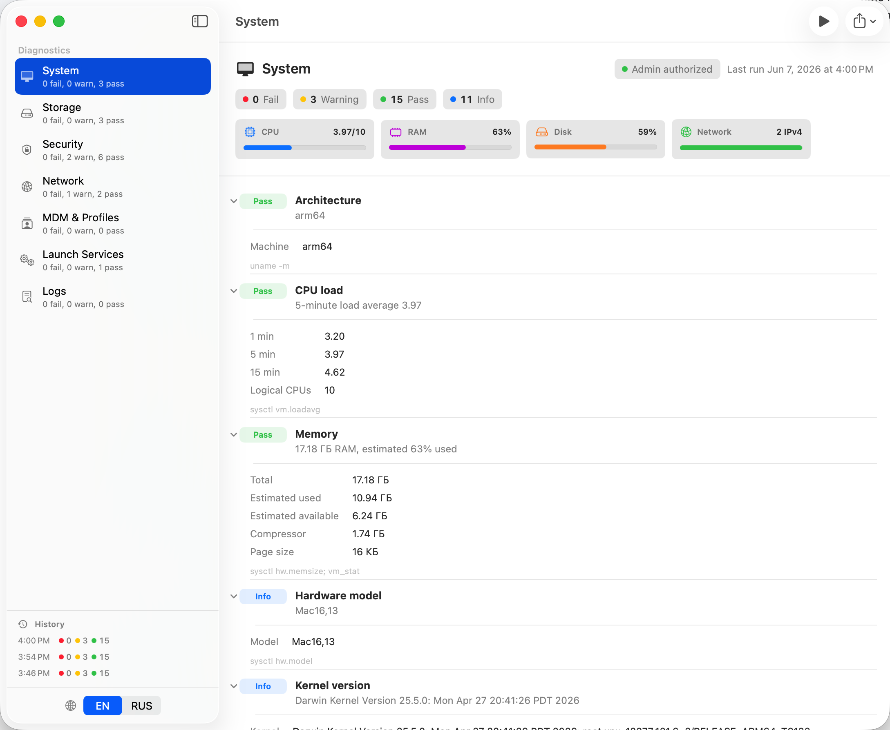
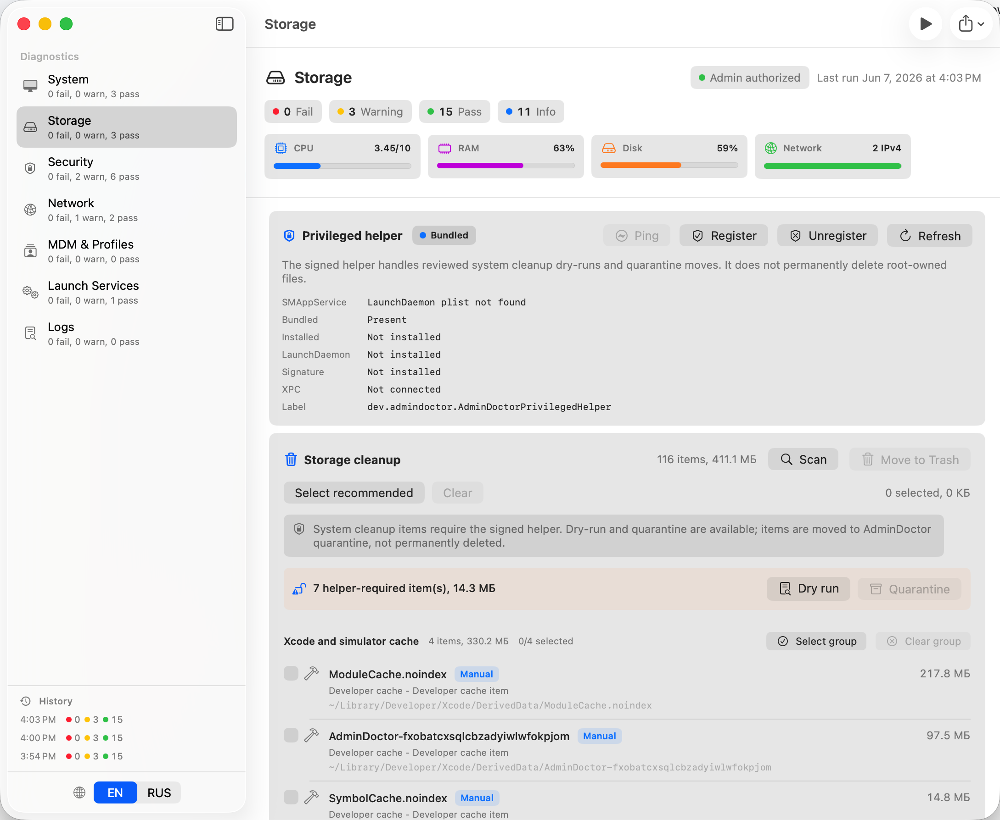
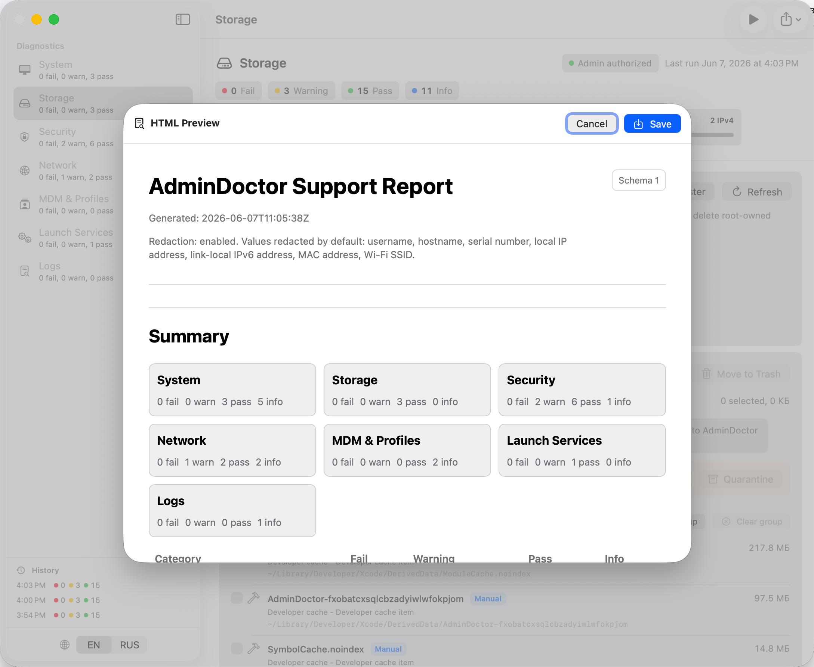

# AdminDoctor

AdminDoctor is a privacy-first macOS diagnostic and admin utility app for system administrators, helpdesk engineers, and Mac fleet maintainers.

The app runs local checks, explains findings clearly, offers carefully scoped safe utilities, and exports a redacted support report that can be shared without exposing unnecessary personal data.






## Installation

English:

1. Download `AdminDoctor.dmg` from the latest GitHub Release.
2. Open the DMG and drag `AdminDoctor.app` to Applications.
3. If macOS blocks this unsigned build, prefer Control-clicking `AdminDoctor.app`, choosing **Open**, then confirming **Open**.
4. Internal/testing workaround only: if your organization allows temporarily disabling Gatekeeper, run:

```sh
sudo spctl --master-disable
```

Open AdminDoctor, then re-enable Gatekeeper immediately:

```sh
sudo spctl --master-enable
```

Русский:

1. Скачайте `AdminDoctor.dmg` из последнего GitHub Release.
2. Откройте DMG и перетащите `AdminDoctor.app` в папку «Программы».
3. Если macOS блокирует неподписанную сборку, сначала используйте более безопасный вариант: Control-click / правый клик по `AdminDoctor.app`, выберите **Открыть**, затем подтвердите **Открыть**.
4. Только для внутреннего тестирования: если политика вашей организации разрешает временно отключить Gatekeeper, выполните:

```sh
sudo spctl --master-disable
```

Откройте AdminDoctor, затем сразу включите Gatekeeper обратно:

```sh
sudo spctl --master-enable
```

## Principles

- Diagnostics are read-only.
- Cleanup actions are explicit, scoped, and move items to Trash instead of permanently deleting them.
- The app requests administrator authorization at launch for admin utility actions.
- No shell `sudo` execution.
- No telemetry or network upload.
- All diagnostics run locally.
- Report exports redact personal data by default.
- External network probes such as Captive Portal and External IP run only after an explicit button press.
- Findings should be useful to real Mac admins, not just dashboard decoration.

## MVP Scope

AdminDoctor is a SwiftPM-based native macOS SwiftUI app with a reusable `AdminDoctorCore` library.

Implemented categories:

- System
- Storage
- Security
- Network
- MDM & Profiles
- Launch Services
- Logs

Implemented checks:

- macOS version and build
- uptime
- Darwin kernel version
- hardware model
- architecture
- CPU load average
- memory pressure snapshot
- top CPU process snapshot
- system volume free space
- APFS status from structured `diskutil` plist output
- SSD/NVMe SMART health when reported by `diskutil`
- FileVault status
- SIP status
- Gatekeeper status
- application firewall status when available
- XProtect and MRT version metadata
- Software Update security setting signals
- recent Apple security-related install history
- TCC Full Disk Access and Accessibility permission signals
- active network interfaces
- DNS nameservers
- default gateway
- system proxy state
- Wi-Fi SSID signal when available
- local LAN scan with ARP discovery, hostname hints, and offline IEEE OUI manufacturer lookup
- Bonjour/mDNS hostname hints, common open-port probes, device type inference, and horizontal table scrolling for LAN scan results
- user-initiated network ping, DNS lookup, traceroute, route table, captive portal, and proxy reachability toolkit
- user-initiated external IP lookup through DNS
- MDM enrollment signal
- installed configuration profile signal
- LaunchAgent and LaunchDaemon plist validation and startup item listing
- explicit MVP log collection policy

Safe utility actions:

- scan user cache, temporary, user log, installer/archive, developer cache, package manager cache, and helper-required system cache/log locations
- group cleanup candidates by source such as npm, Homebrew, Xcode, SwiftPM, Cargo, Gradle, and pip
- label cleanup risk as safe, caution, manual review, or helper required
- show system cache and log candidates as helper-required read-only findings
- preselect only conservative cleanup candidates
- select or clear cleanup candidates by group
- require confirmation before cleanup
- move selected items to Trash for review or restore
- clear the local DNS cache with `dscacheutil -flushcache`
- scan the local /24 LAN view and clear displayed LAN scan results
- export LAN scan results as CSV with port service names
- run on-demand network toolkit checks from the local Mac
- inspect bundled and installed privileged-helper status for system cleanup work
- register, unregister, and ping the bundled privileged helper through `SMAppService` and XPC when the app is built with a valid signing identity
- run privileged helper dry-run plans and move allow-listed system cleanup candidates to AdminDoctor quarantine with JSONL audit logging

Interface helpers:

- compact CPU, RAM, disk, and network resource indicators
- local scan history with fail/warning/pass counts
- EN/RUS language switch in the sidebar
- report preview sheet before writing Markdown, JSON, HTML, or PDF exports

## Privacy

Markdown, JSON, HTML, and PDF exports are redacted by default. The redactor currently handles:

- username
- hostname
- serial number when available
- local IPv4 addresses
- link-local IPv6 addresses
- MAC addresses
- Wi-Fi SSID when present in diagnostic results

AdminDoctor does not upload reports, phone home, or collect analytics. Administrator authorization is requested locally through macOS Authorization Services and kept only for the current app session. Cleanup tools do not scan arbitrary paths or change network services. LAN manufacturer lookup uses bundled IEEE Registration Authority CSV data and does not make runtime vendor lookup requests. Bonjour/mDNS name hints and port probes stay on the local network. Captive portal testing and external IP lookup contact external endpoints only when the user presses those buttons.

## Architecture

```text
Sources/
  AdminDoctor/
    App/
    Views/
  AdminDoctorCore/
    Models/
    Providers/
    Services/
    Support/
Tests/
  AdminDoctorCoreTests/
```

Key boundaries:

- SwiftUI views live in `Sources/AdminDoctor`.
- Diagnostic logic lives in `Sources/AdminDoctorCore`.
- Command execution goes through `CommandRunning`.
- `ProcessRunner` rejects shell and sudo executables and runs fixed executable paths with arguments.
- Administrator authorization state is handled by `AdminPrivilegeManager`.
- Safe cleanup logic lives in `DiskCleanupService`, only trashes configured non-privileged locations, and marks system cleanup candidates as helper-required.
- `PrivilegedCleanupService` restricts helper actions to allow-listed system cleanup candidates, supports dry-run plans, moves eligible items to `/Users/Shared/AdminDoctor/PrivilegedCleanup`, and writes audit events to `/Library/Logs/AdminDoctor/privileged-helper-audit.jsonl`.
- `AdminDoctorPrivilegedHelper` is bundled with a launchd plist, `SMAppService` registration flow, and a privileged XPC contract for status, dry-run, and quarantine helper checks.
- Providers are small and independently testable.
- Report export is handled by `ReportExporter`, with PDF rendering in the app target.

## Development

Build and test:

```sh
swift build
swift test
```

Run as a macOS app bundle:

```sh
./script/build_and_run.sh
```

Regenerate icons and build a local DMG:

```sh
./script/generate_icons.sh
./script/build_dmg.sh
```

The app and DMG icons are generated locally from `Resources/Icons/AdminDoctorIconSource.png`. `script/render_icon.swift` is a fallback source generator if the PNG is missing; generated `.icns` and `.iconset` outputs are intentionally ignored by git.

Build with a signing identity when testing the privileged helper registration flow:

```sh
CODE_SIGN_IDENTITY="Developer ID Application: Example Team (TEAMID)" ./script/build_dmg.sh
```

Without a valid local code-signing identity the app still builds and runs, but the helper is ad-hoc signed and cannot be treated as a production signed privileged helper by macOS.

Signed and notarized releases use `.github/workflows/release.yml`. Configure these GitHub Secrets before pushing a `v*` tag or running the workflow manually:

- `MACOS_CERTIFICATE_P12_BASE64`
- `MACOS_CERTIFICATE_PASSWORD`
- `DEVELOPER_ID_APPLICATION`
- `APPLE_ID`
- `APPLE_TEAM_ID`
- `APPLE_APP_SPECIFIC_PASSWORD`

Local notarization after building a signed DMG:

```sh
APPLE_ID="admin@example.com" \
APPLE_TEAM_ID="TEAMID" \
APPLE_APP_SPECIFIC_PASSWORD="app-specific-password" \
./script/notarize_dmg.sh dist/AdminDoctor.dmg
```

The Codex app Run button is wired through `.codex/environments/environment.toml`.

## Reports

The app exports:

- Markdown support report
- JSON support report
- HTML support report
- PDF support report

ZIP support bundles are intentionally left for a later milestone because they need preview, size estimates, and stricter redaction review.

## Status

AdminDoctor is an early MVP skeleton. It is useful for local first-pass diagnostics, but not yet a replacement for a signed, notarized admin support utility.

See [ROADMAP.md](./ROADMAP.md) for next milestones.

## License

MIT License. See [LICENSE](./LICENSE).
